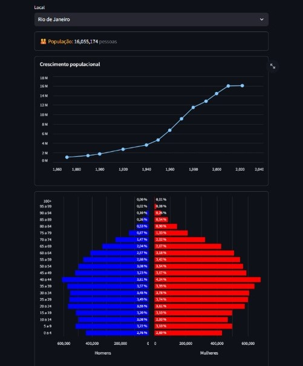

# Visualizador de Dados IBGE

<div align="center">
  
</div>

Este projeto Python utiliza técnicas de webscraping com Selenium e PyAutoGUI para extrair dados de crescimento populacional e pirâmide etária do site do IBGE. Os dados são processados e visualizados de forma interativa utilizando as bibliotecas Pandas, Streamlit e Altair, proporcionando uma análise dinâmica e detalhada das tendências demográficas do Brasil.

## Inspirado por

Este projeto foi inspirado pelo [Portal do IBGE](https://censo2022.ibge.gov.br/panorama/?utm_source=ibge&utm_medium=home&utm_campaign=portal), de onde são extraídos os dados utilizados para análise.

## Como Usar

### Pré-requisitos

- Python 3.x

### Instalação das Bibliotecas

Para instalar as bibliotecas necessárias, execute o seguinte comando no terminal:

```bash
pip install -r requirements.txt
```

O arquivo `requirements.txt` contém as versões específicas das bibliotecas utilizadas neste projeto.

### Executando o Projeto

Siga a ordem abaixo para executar os arquivos:

1. Execute o script `webscraping.py` para fazer o download dos dados:
   ```bash
   python webscraping.py
   ```
2. Execute o script `temp.py` para mover os arquivos baixados para a pasta do projeto:
   ```bash
   python temp.py
   ```
3. Execute o script `app.py` para iniciar o servidor Streamlit e visualizar o dashboard:
   ```bash
   streamlit run app.py
   ```

O aplicativo estará disponível em seu navegador padrão.

## Contribuições

Contribuições são bem-vindas! Sinta-se à vontade para abrir uma issue ou enviar um pull request.

## Licença

Este projeto está licenciado sob a Licença MIT - veja o arquivo [LICENSE](LICENSE) para mais detalhes.
